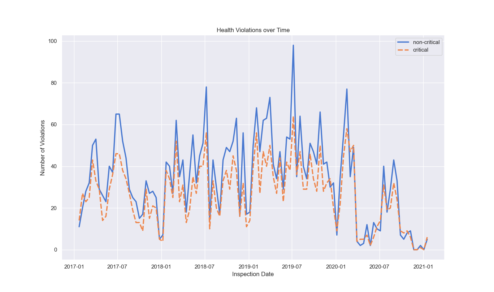

# Surrey Health Inspections
An analysis into restaurant health inspections within the City of Surrey.

## Data
The project uses data obtained from Surrey's Dataset collection found [here](https://data.surrey.ca/dataset), specifically the project uses the `Fraser Health Restaurant Inspection Reports` dataset and the `Restaurants` dataset

## Violations over Time



## Non-Critical vs Critical Correlation


## Data Statistics
Critical | Non-Critical | Total Violation
:---: | :---: | :---:
mean | 5.16 | 6.64 |  11.80
std | 4.97 | 6.43 | 11.07
max | 52 | 68 | 120


## Usage
```
python -m pip install -r requirements.txt  # install dependencies
python ./main.py  # run script
```

## City of Surrey Open Data License
Contains information licensed under the Open Government License – City of Surrey.